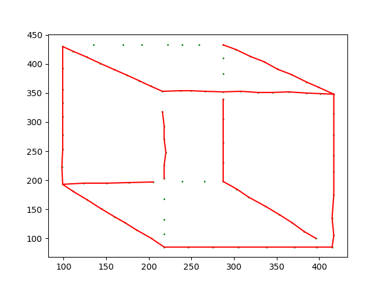
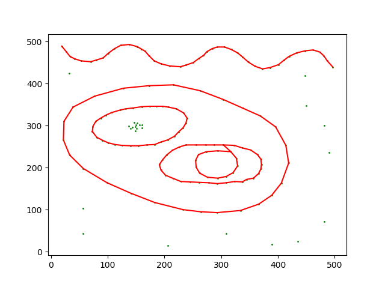
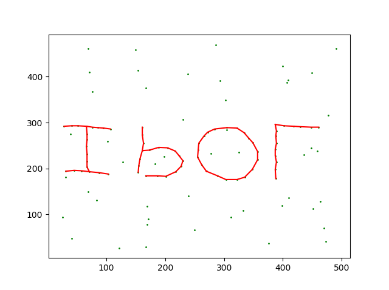
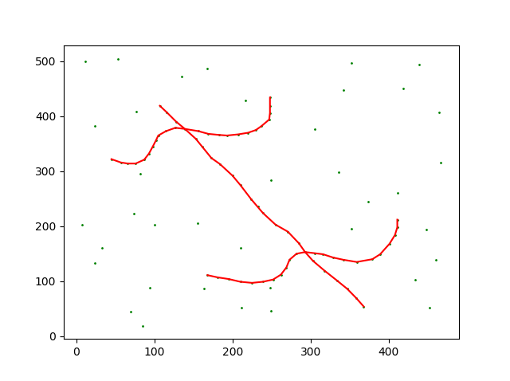
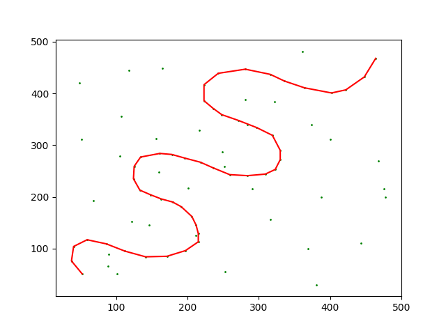
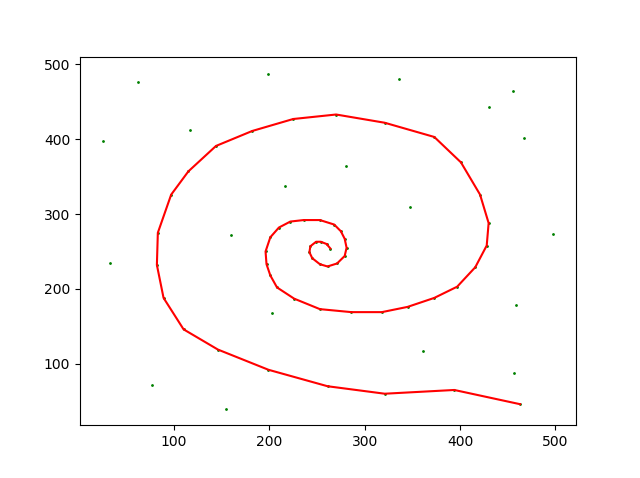

# Detecting-Continuation-in-Dot-Pattern
Unofficial Python Implementation for An Unsupervised Algorithm for Detecting Good Continuation in Dot Patterns

**Note: The implementation is very slow and unoptimized. For a better and faster approach use the matlab code given along with the paper.**  
  
## Tutorial  
To run default examples edit in `main` function
```
python good_cont.py
```
  
## Results
|||
|---|---|
|||  
|||
